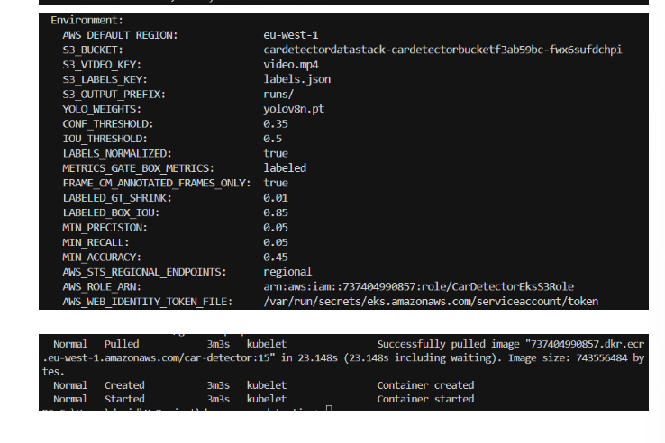

# Submission screenshots

Evidence for the DevOps practical test (Jenkins, ECR, EKS, S3 metrics).

**Populate images:** run `.\screenshots\copy-from-cursor-assets.ps1` from the repo root, or copy your PNGs here using the filenames below.

## Jenkins

### Metrics and SUCCESS

### ECR push

## Amazon ECR

## Amazon EKS

