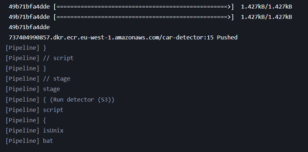
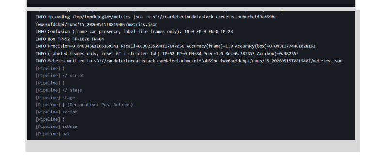
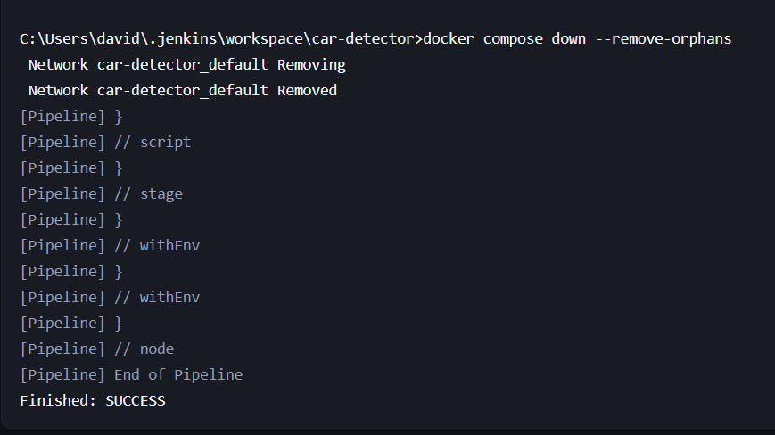
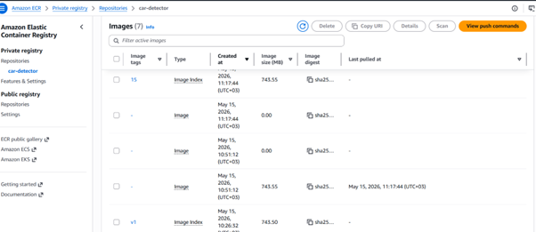
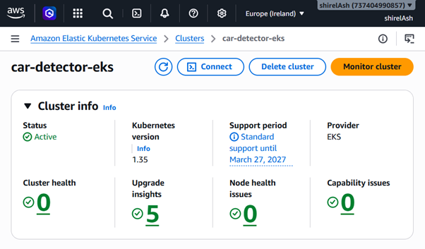
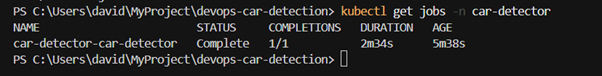
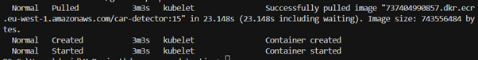
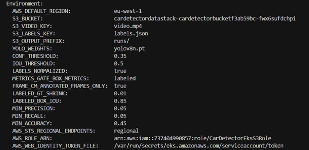
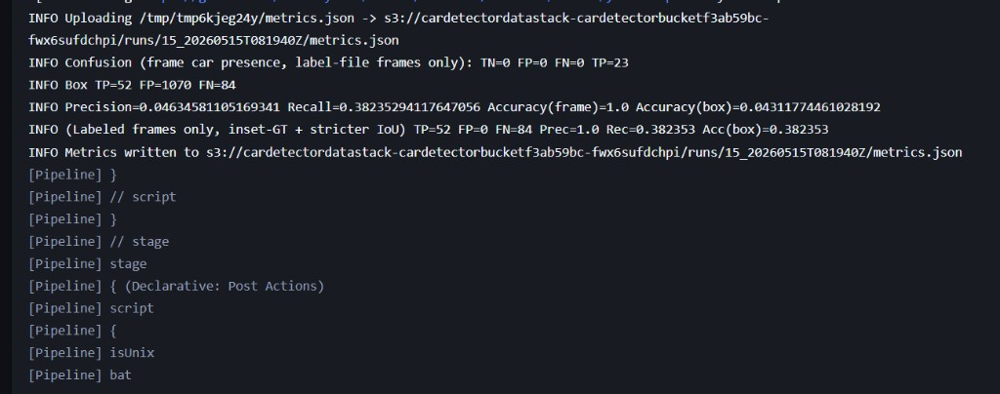
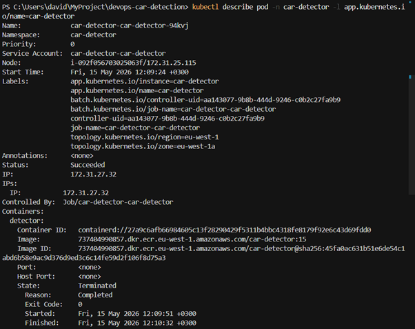

# Submission screenshots

Evidence for the **devops-car-detection** pipeline: Jenkins CI → Amazon ECR → Helm Job on EKS (IRSA) → S3 metrics.

**AWS context (this run):** account `737404990857`, region `eu-west-1`, ECR repo `car-detector`, image tag **`15`**, EKS cluster **`car-detector-eks`**, namespace **`car-detector`**, S3 bucket `cardetectordatastack-cardetectorbucketf3ab59bc-fwx6sufdchpi`.

Suggested reading order: Jenkins (1–3) → ECR (4) → EKS (5–10).

---

## Jenkins CI

### `jenkins-ecr-push.png`

Jenkins console during the **Push to ECR** stage. Docker finishes uploading layers and reports:

`737404990857.dkr.ecr.eu-west-1.amazonaws.com/car-detector:15 Pushed`

The next stage **Run detector (S3)** is about to start. Proves the pipeline builds the image and publishes it to the correct registry (host + repository name, tag = build number).

### `jenkins-metrics-success.png`

Jenkins console during **Run detector (S3)** (docker compose). The app downloads video/labels from S3, runs YOLOv8, computes metrics (confusion matrix, precision, recall, accuracy), and uploads `metrics.json` under a build-scoped prefix, e.g. `runs/15_20260515T081940Z/metrics.json`. Proves end-to-end detection + evaluation + S3 write from CI.

### `jenkins-finished-success.png`

End of the Jenkins pipeline: `docker compose down --remove-orphans` tears down the compose network, then **`Finished: SUCCESS`**. Proves the full Jenkinsfile completed without failure.

---

## Amazon ECR

### `ecr-car-detector-tags.png`

AWS Console → ECR → private repository **`car-detector`**. Shows tagged images (**`15`**, **`v1`**) and image digests/sizes (~743 MB). Proves images from Jenkins are stored in the project repository (not a wrong repo or malformed image name).

---

## Amazon EKS

### `eks-cluster-active.png`

AWS Console → EKS → cluster **`car-detector-eks`**. Status **Active**, Kubernetes version shown, health checks with no blocking issues. Proves the target cluster exists and is healthy before/at deploy time.

### `kubectl-get-jobs.png`

Terminal: `kubectl get jobs -n car-detector`. Job **`car-detector-car-detector`** (Helm release + chart name) is **`Complete`** with **`1/1`** completions. Proves the Helm Job finished successfully on the cluster.

### `eks-pod-image-pulled.png`

`kubectl describe pod` **Events**: kubelet **Pulled** image `…/car-detector:15` from ECR, then **Created** and **Started** the container. Proves the cluster pulls the same image Jenkins pushed (ECR → EKS link).

### `eks-pod-env-irsa.png`

`kubectl describe pod` **Environment** section. Shows S3 keys (`S3_BUCKET`, `S3_VIDEO_KEY`, `S3_LABELS_KEY`, `S3_OUTPUT_PREFIX`), YOLO/threshold settings, and IRSA fields:

- `AWS_ROLE_ARN` → `CarDetectorEksS3Role`
- `AWS_WEB_IDENTITY_TOKEN_FILE` → EKS service account token path

Proves the pod is configured for S3 access via **IAM Roles for Service Accounts**, not long-lived keys in the image.

### `eks-pod-logs-metrics.png`

`kubectl logs` for the detector container. Logs show S3 download of `video.mp4` and `labels.json`, frame count/resolution, YOLO run, metric lines, and upload to e.g. `runs/20260515T091032Z/metrics.json`. Proves the workload ran on EKS and wrote results to S3 (path may differ from Jenkins build `15_*` prefix).

### `eks-describe-pod-success.png`

`kubectl describe pod -n car-detector -l app.kubernetes.io/name=car-detector`. Pod **Status: Succeeded**, container **Reason: Completed**, **Exit Code: 0**, image **`car-detector:15`**. Proves the batch Job’s pod exited cleanly after processing.

---

## Quick reference

| Screenshot | What it proves |
|------------|----------------|
| [jenkins-ecr-push.png](jenkins-ecr-push.png) | CI pushes image to ECR |
| [jenkins-metrics-success.png](jenkins-metrics-success.png) | CI runs detector + S3 metrics |
| [jenkins-finished-success.png](jenkins-finished-success.png) | Jenkins pipeline green |
| [ecr-car-detector-tags.png](ecr-car-detector-tags.png) | Images/tags in ECR |
| [eks-cluster-active.png](eks-cluster-active.png) | EKS cluster ready |
| [kubectl-get-jobs.png](kubectl-get-jobs.png) | Helm Job completed |
| [eks-pod-image-pulled.png](eks-pod-image-pulled.png) | Pod uses ECR image `:15` |
| [eks-pod-env-irsa.png](eks-pod-env-irsa.png) | IRSA + S3 env on pod |
| [eks-pod-logs-metrics.png](eks-pod-logs-metrics.png) | Detector logs + S3 upload on EKS |
| [eks-describe-pod-success.png](eks-describe-pod-success.png) | Pod succeeded (exit 0) |
